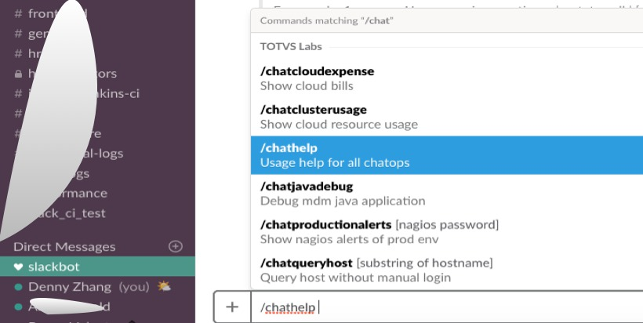

Python slack ChatOps

<a href="https://github.com/DennyZhang?tab=followers"></a>

[](https://travis-ci.org/DennyZhang/chatops_slack) [](https://hub.docker.com/r/denny/chatops_slack/) [](http://makeapullrequest.com)

[](https://www.linkedin.com/in/dennyzhang001) [](https://github.com/DennyZhang) [](https://twitter.com/dennyzhang001) [](https://goo.gl/ozDDyL)

- File me [tickets](https://github.com/DennyZhang/chatops_slack/issues) or star [the repo](https://github.com/DennyZhang/chatops_slack)

- Check more: https://www.dennyzhang.com/tag/chatops
- Reference: https://github.com/slackapi/Slack-Python-Onboarding-Tutorial

# System Design
- Limitation: Only Python3 is supported. (Use [docker deployment](./docker-compose.yml) by default)

# How To Use
## 1. Setup ChatOps Server via docker-compose

1. Prepare ssh_id_rsa and config.py

2. docker-compose up -d

## 2. Setup in client nodes
```
wget -O /usr/sbin/node_usage.py \
     https://raw.githubusercontent.com/DennyZhang/devops_public/tag_v6/python/node_usage/node_usage.py
```

## 3. Create slack commands in Slack setting page
Configure Slack Commands for each python flask endpoint.

## 4. Try the bots in Slack


# Useful commands
```
Check: docker-entrypoint.sh

tail -f /tmp/uwsgi-wsgi.log

docker-compose down && docker-compose up -d && docker exec -it devops_chatops tail -f /tmp/uwsgi-wsgi.log
```
